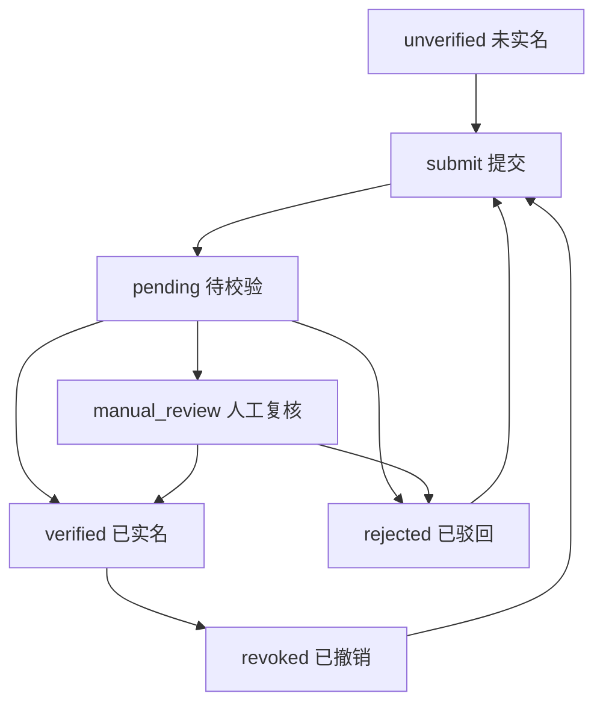

# 实名认证流程与设计

本文档说明当前项目中“实名认证”能力的后端模型、移动端使用流程、后台管理方式，以及为什么这样设计。

## 目标

- 移动端用户可以主动发起实名认证
- 关键业务动作前可以统一拦截未实名用户
- 优先走自动校验，异常场景转人工复核
- 平台保留完整实名信息，但默认以脱敏方式展示
- 后台管理端可以查看记录、处理复核、通过、驳回和撤销

## 设计原则

### 1. 主链路服务于移动端

实名认证的第一使用方是移动端，因此接口设计围绕下面四件事展开：

- 查看当前实名状态
- 提交实名认证申请
- 被驳回后重新提交
- 查看状态时间线和驳回原因

后台管理端不是第一入口，但必须能兜底处理异常和复核场景。

### 2. 用户摘要和实名主表分离

当前实现采用“两层模型”：

- `User`
  - 保存实名摘要字段，便于快速判断和列表展示
  - 字段包括：`real_name_status`、`real_name_verified_at`、`real_name_masked`、`id_number_masked`
- `RealNameVerification`
  - 保存每次当前实名申请的完整记录
  - 包含状态、来源、校验渠道、加密后的姓名与身份证号、脱敏展示值、失败原因、审核备注、审核人、审核时间等
- `RealNameVerificationLog`
  - 保存状态流转日志，供 app 时间线和后台审计使用

这样做的好处是：

- 用户列表和 app 上下文可以直接读摘要字段，响应更轻
- 实名审核记录、回执、备注、复核动作不会污染用户主表
- 后续接入真正第三方服务时，不需要推翻现有结构

## 枚举规范

本功能全部沿用项目现有的 `StrChoices` 规范，定义在：

- `apps/accounts/constants.py`

当前包含以下枚举：

- `RealNameStatus`
  - `unverified`
  - `pending`
  - `verified`
  - `rejected`
  - `manual_review`
  - `revoked`
- `RealNameSource`
  - `user_submit`
  - `business_gate`
- `RealNameProvider`
  - `mock_auto`
  - `manual_admin`
- `RealNameLogAction`
  - `submitted`
  - `auto_verified`
  - `auto_rejected`
  - `moved_to_manual_review`
  - `manual_approved`
  - `manual_rejected`
  - `revoked`

## 数据安全

### 完整信息保留

需求要求“保留完整实名信息”，因此系统会保存完整真实姓名和完整身份证号。

### 默认加密存储

完整信息不会直接明文落在主字段中，而是：

- 使用 `SECRET_KEY` 派生出的 Fernet key 进行对称加密
- 存储到：
  - `real_name_encrypted`
  - `id_number_encrypted`

同时保留以下辅助字段：

- `real_name_masked`
- `id_number_masked`
- `id_number_last4`
- `id_number_hash`

这样可以兼顾三件事：

- 默认列表只展示脱敏值
- 后台详情页在高权限场景下可查看完整值
- 系统可以通过 `id_number_hash` 做重复证件检测

## 自动校验与人工复核

### 当前实现

当前版本先提供一个稳定的“模拟自动校验”服务层，规则如下：

1. 真实姓名长度不足，直接驳回
2. 身份证号格式或校验位无效，直接驳回
3. 如果该身份证号已经被其他账号实名成功，转人工复核
4. 其余合法场景，自动通过

这让系统具备了真正的“自动通过 + 自动驳回 + 人工兜底”三分流能力。

### 为什么先用模拟校验

因为当前仓库里还没有接入正式三要素/二要素实名服务。先把状态流、数据结构和后台处理能力做完整，后面接入阿里云、腾讯云或第三方实名厂商时，只需要替换服务层的判定逻辑，不需要重做模型和前后端页面。

## 移动端使用流程

### 主动入口

建议在移动端“我的 / 账号与安全 / 实名认证”中提供独立入口。

页面根据状态展示不同内容：

- `unverified`
  - 展示提交表单
- `verified`
  - 展示已实名状态、脱敏姓名、脱敏身份证号、认证时间
- `rejected`
  - 展示驳回原因和重新提交入口
- `manual_review`
  - 展示“人工复核中”，阻止重复乱提
- `revoked`
  - 展示已撤销原因，并允许重新发起

### 业务拦截入口

对于提现、接单、报名、发布等关键动作，建议统一在业务接口中检查实名状态。

推荐策略：

- `verified`：放行
- `unverified`：返回业务错误码并引导去实名认证
- `manual_review`：提示“认证复核中，暂不可继续”
- `rejected`：提示驳回原因并引导重新提交
- `revoked`：提示需要重新认证

### 状态时间线

移动端可以直接使用 `/api/users/me/real-name/logs/` 渲染时间线，例如：

- 已提交
- 自动通过
- 自动驳回
- 转人工复核
- 人工通过
- 人工驳回
- 被撤销

## 后端接口

### 移动端接口

- `GET /api/users/me/real-name/`
  - 获取当前实名摘要和状态
- `GET /api/users/me/real-name/logs/`
  - 获取当前实名认证时间线
- `POST /api/users/me/real-name/submit/`
  - 提交实名认证申请
- `POST /api/users/me/real-name/retry/`
  - 在驳回或撤销后重新提交

### 后台接口

- `GET /api/admin/real-name-verifications/`
  - 按状态、用户名、邮箱、手机号、身份证后四位筛选
- `GET /api/admin/real-name-verifications/{id}/`
  - 获取实名详情、完整证件信息、时间线
- `POST /api/admin/real-name-verifications/{id}/manual-review/`
  - 转人工复核
- `POST /api/admin/real-name-verifications/{id}/approve/`
  - 人工通过
- `POST /api/admin/real-name-verifications/{id}/reject/`
  - 人工驳回
- `POST /api/admin/real-name-verifications/{id}/revoke/`
  - 撤销实名

## 后台管理端处理逻辑

frontadmin 当前新增了独立的“实名认证”管理页，处理逻辑如下：

- 列表页默认展示脱敏信息
- 支持按状态筛选
- 支持按用户名、邮箱、手机号、身份证后四位搜索
- 详情页显示完整实名信息和状态时间线
- 审核动作统一记录备注，便于：
  - app 展示驳回原因
  - 后台复盘处理过程
  - 后续审计

## 状态流转

## 当前边界

当前版本刻意没有把这些内容一起塞进第一版：

- 身份证图片上传
- OCR
- 活体检测
- 外部实名服务正式对接
- 细粒度“谁可以查看完整证件明文”的权限系统

这样做是为了先把核心闭环做稳：

- 用户可提交
- 系统可判定
- 管理端可处理
- 状态可追踪

后续扩展时，可以优先沿这几个方向演进：

1. 接入真实实名服务商
2. 将“完整证件查看”收敛到单独权限
3. 加入证件图片与 OCR 辅助材料
4. 在业务域里统一封装“实名门禁”检查
