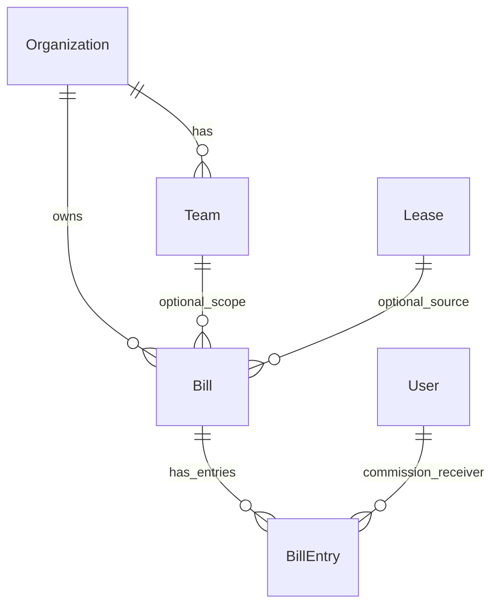

# 租户财务账单设计（一期）

日期：2026-07-04
状态：草案（待评审）

## 1. 背景与目标

平台已有租户、团队、房源租赁、租约、钱包与租户设置能力。当前需要补齐一套轻量的租户经营记账能力，用于记录租约成交、团队日常收支、租户日常收支、员工提成和公司留存。

一期目标是做一套能落地、可解释、后续可拆分的账单模型，不做完整财务中台。

核心目标：

- 租户管理员能查看租户整体收支。
- 租户管理员能按团队查看收支。
- 租约可以生成经营账单，用于查看房源历史真实成交额。
- 财务人员可以手工登记日常收入、日常开支、收款、付款。
- 一张账单可以给多个租户成员记录提成，每个成员支持比例或固定金额。
- 钱包不参与账单；账单提成只是经营记录，不自动生成可提现余额。

## 2. 范围与非范围

### 2.1 范围内

- 新增独立 `finance` 业务域。
- 新增 `Bill` 账单头表。
- 新增 `BillEntry` 账单条目表。
- `Lease` 增加可空成交团队字段，用于把租约账单归到团队。
- `Bill` 必属一个租户，可选归属一个团队。
- `Bill` 可选关联租约；不关联租约时就是手工账单。
- 后端提供账单、条目、提成、汇总和租约创建账单接口。
- 管理端提供账单列表、账单详情、从租约创建账单、手工记账、团队筛选。

### 2.2 范围外

- 不做复式记账、科目、凭证、会计期间。
- 不做发票、支付渠道回调、银行对账。
- 不接个人钱包，不自动发放提成。
- 不做组织钱包。
- 不做通用业务来源 `source_type/source_id`。一期只有可空 `lease` 外键；等第二个真实业务来源出现再扩展。
- 不单独拆 `BillLine`、`BillPayment`、`BillAllocation`。一期统一放在 `BillEntry`。
- 不做默认提成规则。每张账单内直接录提成，等重复录入成为真实问题后再接租户设置。

## 3. 方案选型

### 3.1 备选方案

方案 A（推荐）：`Bill + BillEntry` 两张核心表。
账单头保存租户、团队、租约来源和状态；条目统一承载收入、成本、收款、付款、员工提成，汇总由条目聚合得到。

方案 B：`Bill + BillLine + BillPayment + BillAllocation`。
语义更纯，但第一期表多、页面多、交互更重，用户也更难理解。

方案 C：完整财务中台。
支持科目、凭证、借贷、结账期、对账等能力，但明显超过当前租赁业务需要。

### 3.2 选型结论

采用方案 A。

理由：

- 两张表即可覆盖租约账、团队账、日常收支和员工提成。
- 与当前项目已有模式匹配，`finance` 域独立，不提前做财务中台。
- 未来需要支付回调、发票、对账或真实提成发放时，可以从 `BillEntry` 的 `receipt`、`payout`、`commission` 类型拆出专表，不需要推翻 `Bill`。

## 4. 领域边界

- `house.Lease`：租赁事实，记录房源、租客、租期、合同租金、合同文件和租约状态。
- `finance.Bill`：经营账单，记录某个租户或团队的一笔经营账。
- `finance.BillEntry`：账单条目，记录收入、成本、收款、付款、员工提成。
- `wallet`：个人资金账户，只处理用户余额和提现；一期不与账单关联。

租约可以查看关联账单摘要，但租约不负责记账。账单负责真实经营结果。

## 5. ER 图



## 6. 数据模型

### 6.0 Lease 补充字段

租约需要增加一个可空字段：

- `deal_team`：成交团队，可空，必须属于租约所在 `organization`。

用途：

- 租约账单创建时默认复制 `deal_team` 到 `Bill.team`。
- 房源历史成交和团队业绩报表可以按成交团队归集。

如果租约没有成交团队，创建出的账单就是租户级账单，后续可在账单上手动选择团队。

### 6.1 Bill

用途：账单头。一张 `Bill` 表示一笔租户或团队经营账。

建议字段：

- `organization`：必填，账单所属租户。
- `team`：可空，账单所属团队。为空表示租户级账。
- `lease`：可空，关联租约。为空表示手工账单。
- `title`：账单标题。
- `status`：状态，取值为 `pending`、`confirmed`、`settled`、`voided`。
- `remark`：备注。
- `created_by`、`updated_by`：操作人快照，可空。
- `created_at`、`updated_at`。

账单汇总不存字段，一期从 `BillEntry` 聚合计算。等列表性能真的不够时，再加汇总缓存。

约束：

- `organization` 必填。
- `team` 如果有值，必须属于同一 `organization`。
- `lease` 如果有值，必须属于同一 `organization`。
- 同一租约默认只允许一张未作废账单，避免重复记账。若确实需要补充账，可在同一账单内新增条目。

### 6.2 BillEntry

用途：账单条目。一张账单的收入、成本、实际收付和员工提成都在这里记录。

建议字段：

- `bill`：所属账单。
- `entry_type`：条目类型，取值为 `income`、`cost`、`receipt`、`payout`、`commission`。
- `category`：业务分类，例如 `rent_income`、`landlord_payable`、`daily_expense`、`manual_income`、`manual_payout`。
- `title`：条目标题。
- `amount`：最终金额，非负。方向由 `entry_type` 决定。
- `occurred_on`：发生日期。
- `user`：可空，仅 `commission` 条目使用，必须是当前租户成员。
- `user_name_snapshot`：提成员工姓名快照，仅 `commission` 条目使用。
- `calc_method`：提成计算方式，仅 `commission` 条目使用，取值为 `percent` 或 `fixed`。
- `rate`：比例提成时使用，例如 `0.60`。
- `base_amount`：比例提成基数快照，默认是账单净收益。
- `calculated_amount`：系统按规则算出的金额。
- `remark`：备注。
- `created_at`、`updated_at`。

规则：

- `income`：表示应收或经营收入，参与净收益计算。
- `cost`：表示应付或经营成本，参与净收益计算。房东应结、日常开支都归到这里。
- `receipt`：表示实际收款，只影响已收款，不参与净收益计算。
- `payout`：表示实际付款，只影响已付款，不参与净收益计算。
- `commission`：表示员工提成，参与公司留存计算。

`manual` 不是提成计算方式。人工修改只是覆盖 `amount`，同时保留 `calculated_amount`。是否人工调整由 `amount != calculated_amount` 派生。

所有 `amount` 都是非负数。需要做经营调整时，使用 `income` 或 `cost` 条目的具体 `category` 表达，不在一期引入负数条目。

## 7. 金额口径

账单汇总由 `BillEntry` 重算得到：

- 收入 = `income` 条目金额合计
- 成本 = `cost` 条目金额合计
- 净收益 = 收入 - 成本
- 已收款 = `receipt` 条目金额合计
- 已付款 = `payout` 条目金额合计
- 员工提成 = `commission` 条目金额合计
- 公司留存 = 净收益 - 员工提成

收入/成本是经营口径，收款/付款是现金动作。收款和付款不参与净收益计算。

提成允许超过净收益，公司留存允许为负。系统只做提示和如实记录，不阻断保存或确认。

## 8. 状态流转

状态：

- `pending`：待确定。账单可编辑，适合刚从租约生成或手工草拟。
- `confirmed`：已确认。账单业务口径已确认，仍允许登记收款、付款和必要备注。
- `settled`：已结清。表示财务确认该账单已完成。
- `voided`：已作废。用于错误账单，不参与默认报表汇总。

推荐流转：

- `pending -> confirmed`
- `pending -> voided`
- `confirmed -> settled`
- `confirmed -> voided`

一期不做复杂审批。状态由用户操作推进。部分收款不用单独状态，通过 `confirmed` 且 `receipt` 合计大于 0 派生展示。

## 9. 提成录入

一期不做租户默认提成规则，也不保存规则快照。财务人员在每张账单里直接新增 `commission` 条目：

- 比例提成：`calc_method=percent`，填写 `rate` 和 `base_amount`，系统计算 `calculated_amount`，默认同步到 `amount`。
- 固定提成：`calc_method=fixed`，填写 `amount`，`calculated_amount` 默认等于 `amount`。
- 人工调整：修改 `amount`，保留原 `calculated_amount`。

等同类账单反复录入成为真实问题后，再把默认规则放到现有租户设置。

## 10. 业务流程

### 10.1 租约账单

1. 租约创建或成交后，用户在租约页点击“创建账单”。
2. 后端创建 `Bill`：
   - `organization = lease.organization`
   - `team = lease.deal_team`，如果租约没有成交团队则为空
   - `lease = 当前租约`
   - `status = pending`
3. 后端按租约生成初始收入条目，例如租金收入。
4. 财务人员补充房东应结、日常成本、收款、付款、员工提成。
5. 用户确认账单并按实际收付款推进状态。

### 10.2 手工账单

1. 用户在财务模块创建账单。
2. 选择租户级或某个团队。
3. 不绑定租约。
4. 添加收入、成本、收款、付款或员工提成条目。
5. 按状态推进。

### 10.3 房源历史成交

房源详情可通过 `House -> Lease -> Bill` 展示历史成交：

- 合同口径：来自 `Lease`，例如合同租金、租期、押金。
- 真实经营口径：来自 `Bill`，例如收入、已收款、净收益、员工提成、公司留存。

“真正成交额”默认使用 `income` 条目聚合金额，而不是只看 `Lease.monthly_rent`。

## 11. API 设计

一期不拆 `/api/admin/finance/`。统一使用 `/api/finance/`，通过当前租户上下文、团队权限和用户身份控制可见范围。

视角规则：

- 租户管理员和组织财务：可查看和维护当前租户全部账单、条目、提成和汇总。
- 团队财务：可查看和维护自己有权限团队下的账单、条目、提成和汇总。
- 普通员工：不能访问账单列表和账单详情，只能通过提成接口查看自己可见的提成条目和来源摘要。

### 11.1 账单

- `GET /api/finance/bills/`：账单列表。
- `POST /api/finance/bills/`：创建账单。传 `lease_id` 时创建租约账单，不传时创建手工账单。
- `GET /api/finance/bills/{bill_id}/`：账单详情，包含条目和聚合汇总。
- `PATCH /api/finance/bills/{bill_id}/`：更新账单头、状态和备注。作废账单使用 `{ "status": "voided" }`。

账单列表 query 参数：

- `page`、`page_size`
- `team_id`
- `lease_id`
- `status`
- `date_from`、`date_to`
- `q`：按标题或来源摘要搜索

账单列表返回每条账单的聚合摘要，包括收入、成本、已收、已付、提成、净收益和公司留存。这些金额由 `BillEntry` 聚合，不在 `Bill` 上存缓存。

创建账单请求：

```json
{
  "title": "云岸 1栋 1001 租约账单",
  "team_id": 2,
  "lease_id": 10,
  "remark": ""
}
```

创建租约账单时，后端从租约带出 `organization`、`deal_team`、来源摘要，并生成一条初始 `income` 条目。手工账单不传 `lease_id`。

### 11.2 条目

- `POST /api/finance/bills/{bill_id}/entries/`：新增条目。
- `PATCH /api/finance/entries/{entry_id}/`：更新条目。
- `DELETE /api/finance/entries/{entry_id}/`：删除条目。

条目维护规则：

- `pending` 账单允许新增、更新和删除条目。
- `confirmed` 账单只允许新增 `receipt`、`payout` 条目和修改备注类信息。
- `settled`、`voided` 账单不允许维护条目。
- 发现已确认账单的经营口径录错时，一期采用作废后重建，暂不做冲正流程。

提成条目请求示例：

```json
{
  "entry_type": "commission",
  "category": "lease_commission",
  "title": "A 员工提成",
  "amount": "600.00",
  "occurred_on": "2026-07-04",
  "user_id": 8,
  "calc_method": "percent",
  "rate": "0.60",
  "base_amount": "1000.00",
  "calculated_amount": "600.00",
  "remark": ""
}
```

### 11.3 提成

- `GET /api/finance/commissions/`：返回当前用户可见的提成条目。

提成接口 query 参数：

- `page`、`page_size`
- `user_id`
- `team_id`
- `bill_id`
- `date_from`、`date_to`

可见范围由权限决定，query 参数只能收窄范围，不能扩大范围：

- 普通员工：只返回自己的提成；传其他 `user_id` 不会看到别人的数据。
- 团队财务：返回自己有权限团队内的提成，可用 `team_id`、`user_id` 收窄。
- 组织财务和租户管理员：返回当前租户内的提成，可用 `team_id`、`user_id` 收窄。

返回字段只包含提成和来源摘要，不返回完整账单明细、净收益或公司留存：

```json
{
  "items": [
    {
      "id": 99,
      "amount": "600.00",
      "occurred_on": "2026-07-04",
      "calc_method": "percent",
      "rate": "0.60",
      "bill_id": 1,
      "bill_title": "云岸 1栋 1001 租约账单",
      "bill_status": "confirmed",
      "team_id": 2,
      "team_name": "南山一组",
      "lease_id": 10,
      "source_label": "云岸 / 1栋 / 1001"
    }
  ],
  "total": 1,
  "page": 1,
  "page_size": 20
}
```

### 11.4 报表

- `GET /api/finance/summary/`：租户财务汇总。
- `GET /api/finance/summary/?group_by=team`：按团队汇总。

汇总 query 参数：

- `date_from`、`date_to`
- `team_id`
- `group_by=team`

所有分页接口继续使用项目统一分页参数 `page`、`page_size`。

## 12. 权限

复用现有财务权限：

- `finance.finance_bill_view`：查看账单、查看汇总。
- `finance.finance_bill_manage`：创建账单、更新账单、维护条目、作废账单。
- `finance.finance_bill_refund`：第一期不做退款，可暂不使用。
- `finance.finance_report_export`：第一期不做导出，可暂不使用。

权限规则：

- `org_admin` 拥有全部财务权限。
- `org_finance` 默认拥有 `finance_bill_view` 和 `finance_bill_manage`。
- `team_finance` 默认拥有团队范围的 `finance_bill_view` 和 `finance_bill_manage`。
- 普通员工不需要财务权限即可访问 `/api/finance/commissions/`，但只能看到自己的提成。

## 13. 管理端设计

新增财务模块页面：

- `/finance/bills`：账单列表。
- `/finance/bills/:id`：账单详情。
- 租约详情或租约列表行提供“创建账单 / 查看账单”入口。

账单列表：

- 支持按状态、团队、租约、日期筛选。
- 展示标题、团队、来源、收入、成本、净收益、已收、提成、公司留存、状态。

账单详情：

- 顶部展示账单摘要和状态操作。
- 条目区按类型分组：收入、成本、收款、付款、员工提成。
- 提成条目可选择当前租户成员，支持比例和固定金额。
- 展示公司留存，负数时只提示，不阻断。

提成列表：

- 财务角色可按团队、员工、账单、日期筛选提成。
- 普通员工只看到自己的提成和来源摘要，不展示账单完整明细。

租约页：

- 展示合同口径和经营口径。
- 已有关联账单时展示账单摘要与跳转。
- 无账单时允许创建待确定账单。

## 14. 测试重点

后端测试：

- 租约创建账单时继承组织和团队。
- 异租户团队、异租户租约不能关联到账单。
- `BillEntry` 新增、更新、删除后账单聚合汇总正确。
- 收入、成本、收款、付款、提成的金额口径正确。
- 提成比例和固定金额计算正确。
- 人工调整提成金额后保留 `calculated_amount`。
- 提成超过净收益时允许保存，公司留存为负。
- 作废账单不进入默认汇总。
- 租约只能有一张未作废账单。
- `finance_bill_manage` 才能创建账单和维护条目。
- 普通员工访问 `/api/finance/commissions/` 只能看到自己的提成。
- 团队财务访问 `/api/finance/commissions/` 只能看到授权团队内的提成。

前端测试：

- 账单详情新增不同类型条目后汇总展示正确。
- 租约页能展示账单摘要并跳转到账单详情。
- 提成列表不会向普通员工展示账单完整明细。

## 15. 后续扩展

在真实需求出现后再扩展：

- 有支付渠道回调时，把 `receipt` 拆成收款表。
- 有真实付款审批或代付时，把 `payout` 拆成付款表。
- 有提成发放到钱包时，把 `commission` 拆成提成结算表，并增加发放状态。
- 有多业务来源时，把 `Bill.lease` 替换或补充为通用业务来源。
- 有重复提成规则录入痛点时，再用租户设置或规则表保存默认规则。
- 有审计要求时，账单条目改为软删除或追加冲正条目。

## 16. 验收口径

一期完成后，应满足：

- 租户管理员可以查看全租户账单。
- 租户管理员可以按团队查看账单与汇总。
- 租约可以创建并查看关联账单。
- 手工账单可以记录租户级和团队级日常收支。
- 一张账单能记录多个员工提成，支持比例和固定金额。
- 提成不进入钱包。
- 房源历史签约能看到合同金额和真实经营金额。
