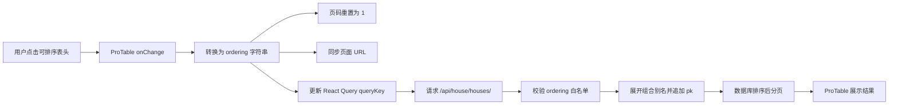

# 房源列表排序能力设计

## 背景

管理端房源列表当前使用 `ProTable` 展示服务端分页数据，每页 20 条。前端表头没有配置排序能力，后端 `/api/house/houses/` 也没有接收动态排序参数，当前固定按“项目名称 → 楼栋名称 → 房号”升序返回。

因为数据由后端分页，排序必须在后端查询阶段完成。仅在浏览器中排序会只改变当前页数据顺序，不能得到全量房源的正确排序结果。

## 目标

- 房源列表前端提供单列升序、降序和清除排序能力。
- 排序状态写入页面 URL，支持刷新、前进、后退和链接分享后恢复。
- 房源列表接口支持最多 3 个字段的组合排序，为后续其他客户端或页面复用保留能力。
- 排序字段通过公开别名和后端白名单解析，不暴露 Django ORM 字段路径。
- 保证服务端分页下的排序结果稳定，不因相同排序值出现重复或遗漏。

## 非目标

- 前端本期不提供 Shift 多列排序或排序条件编辑器。
- 不支持媒体、标签、内部备注和操作列排序。
- 不改变分页响应结构和现有搜索、房态、楼栋筛选行为。
- 不修改房源数据模型，不新增数据库迁移。
- 不预先增加数据库索引；是否增加索引以真实数据量和查询计划为依据。

## API 契约

接口继续使用现有路径，通过可选的 `ordering` query parameter 指定排序：

```http
GET /api/house/houses/?ordering=-asking_rent,room_number
```

语法规则：

- 使用英文逗号分隔多个字段。
- 无前缀表示升序，例如 `room_number`。
- `-` 前缀表示降序，例如 `-asking_rent`。
- 未传 `ordering` 时默认值为 `building`；该别名展开为“项目展示名称 → 楼栋名称 → 房号”，后端再追加 `pk ASC`。
- 最多允许 3 个排序字段，限制按公开排序字段计数，组合别名展开后的 ORM 字段不占用额外名额。
- 字段名必须存在于后端白名单，不能直接使用 `building__estate__name` 等 ORM 路径。
- 重复字段只保留第一次出现的位置和方向。
- 显式传入空字符串、未知字段、连续逗号产生的空字段或超过字段数量限制时返回项目统一的 `400 VALIDATION_ERROR`，错误信息应指出允许使用的排序字段。
- 接口响应仍为 `{ items, total, page, page_size }`，不增加排序回显字段。

建议后端参数声明直接表达默认值、格式、示例和用途：

```python
ordering: str = Query(
    "building",
    description=(
        "排序字段，多个字段使用英文逗号分隔，字段前的 - 表示降序，最多 3 项。"
        "允许字段：room_number、layout、building、asking_rent、deposit_amount、"
        "landlord、has_elevator_access、status、area、floor、created_at、updated_at。"
    ),
    pattern=r"^-?[a-z_]+(?:,-?[a-z_]+){0,2}$",
    example="-asking_rent,room_number",
)
```

### OpenAPI 表达

上述声明生成 OpenAPI 时应体现：

- 参数位置为 query，名称为 `ordering`。
- 参数不是必传项，schema 类型为 `string`。
- schema 默认值为 `building`。
- schema 包含最多 3 个逗号分隔字段的格式约束 `pattern`。
- 参数说明中列出允许字段、逗号分隔规则和 `-` 降序规则。
- 示例值为 `-asking_rent,room_number`。

由于合法值支持前缀和多字段组合，`ordering` 不适合声明为固定 OpenAPI `enum`。后端白名单仍是最终校验来源，允许字段通过参数描述呈现在交互文档中。重新生成管理端 API client 后，参数类型应为 `ordering?: string`；生成函数会识别并标注默认值 `building`。

## 可排序字段

### 前端开放字段

| 表格列 | API 排序字段 | 升序含义 | 降序含义 |
| --- | --- | --- | --- |
| 房源 | `room_number` | 房号文本升序 | 房号文本降序 |
| 户型 | `layout` | 卧室数 → 客厅数 → 卫生间数 → 面积升序 | 同一组合全部降序 |
| 所属楼栋 | `building` | 项目展示名称 → 楼栋名称 → 房号升序 | 同一组合全部降序 |
| 挂牌租金 | `asking_rent` | 金额由低到高 | 金额由高到低 |
| 押金 | `deposit_amount` | 金额由低到高 | 金额由高到低 |
| 房东 | `landlord` | 房东名称升序 | 房东名称降序 |
| 电梯 | `has_elevator_access` | 步梯优先 | 电梯优先 |
| 房态 | `status` | 按房态业务顺序 | 业务顺序反转 |

“媒体、标签、内部备注、操作”列不显示排序入口。媒体需要额外聚合图片和视频数量；标签属于多值数据；内部备注属于长文本；操作列不是业务数据，均不适合作为本期排序项。

### 后端额外开放字段

后端白名单同时开放以下基础字段，便于其他客户端和后续页面复用，但房源列表前端本期不提供对应的独立排序入口：

```text
area
floor
created_at
updated_at
```

## 后端排序映射

公开字段不能直接拼接到 `QuerySet.order_by()`。后端维护明确的映射表，将公开别名转换为一个或多个受控 ORM 排序表达式：

```text
room_number         → room_number
layout              → bedrooms, living_rooms, bathrooms, area
building            → 项目展示名称, building.name, room_number
asking_rent         → asking_rent
deposit_amount      → deposit_amount
landlord            → landlord.name
has_elevator_access → has_elevator_access
status              → 房态业务顺序表达式
area                → area
floor               → floor
created_at          → created_at
updated_at          → updated_at
```

组合别名的方向应用到其展开后的所有字段。例如：

```text
-layout → bedrooms DESC, living_rooms DESC, bathrooms DESC, area DESC
```

项目名称排序应与页面展示一致：优先使用 `display_name`，当其为空时使用 `name`。房东为空以及租金、押金、面积、楼层等可空字段，无论升序还是降序都使用 `NULLS LAST`。

房态升序使用固定业务顺序，不按英文枚举值的字母顺序排列：

```text
招租中 → 空置 → 装修中 → 已租 → 停用
```

降序使用上述顺序的完全反转。

解析完成后，如果排序表达式中没有主键，后端自动追加 `pk ASC`，确保相同排序值下仍有确定顺序，避免翻页时出现重复或遗漏。

未传 `ordering` 时使用公开默认值 `building`，其展开结果保持当前业务顺序并补充稳定排序项：

```text
项目展示名称 ASC → 楼栋名称 ASC → 房号 ASC → pk ASC
```

## 前端交互设计

房源列表继续使用现有 `ProTable`，前端只允许一个列排序状态生效：

1. 第一次点击可排序表头：升序。
2. 第二次点击：降序。
3. 第三次点击：清除排序并恢复后端默认排序。

可排序列配置 `sorter: true`，由 ProTable 内部管理当前 `sortOrder`，不在业务代码中直接受控覆盖。列使用 API 排序字段作为稳定的 `key`，不依赖展示用 `dataIndex`：

```text
house           → room_number
layout          → layout
building        → building
asking_rent     → asking_rent
deposit_amount  → deposit_amount
landlord        → landlord
has_elevator_access → has_elevator_access
status__mapping → status
```

排序改变时：

- `onChange` 的第三个参数类型可能是单个排序对象或数组；前端单列模式先排除数组分支。
- 使用 `sorter.columnKey` 获取 API 排序别名，不使用可能来自展示 `dataIndex` 的 `sorter.field`。
- 将 Ant Design 的 `ascend` 转换为无前缀字段。
- 将 `descend` 转换为带 `-` 前缀字段。
- 清除排序时移除 `ordering`。
- 将页码重置为第 1 页。
- 将 `ordering` 加入 React Query 的 `queryKey`。
- 请求 `/api/house/houses/` 时透传 `ordering`。
- 将排序同步到当前页面 URL。

从 URL 初始化或恢复排序时，在对应列设置 `defaultSortOrder`：

```text
ordering=asking_rent  → defaultSortOrder=ascend
ordering=-asking_rent → defaultSortOrder=descend
```

ProTable 不提供用于外部直接设置内部排序状态的稳定公开方法，因此表格使用由外部 `ordering` 派生的 React `key` 重新初始化排序状态。现有 `columnsState` 已由页面外部状态管理，表格重新初始化不会丢失用户的列显示、顺序和固定列偏好。

示例页面地址：

```text
/dashboard/rental/properties/list?ordering=-asking_rent
```

页面初始化以及浏览器 `popstate` 事件发生时，从 URL 恢复排序。房源列表前端只接受一个白名单字段；如果页面 URL 中包含多个字段或非法字段，则恢复默认排序并移除无效状态。后端的多字段能力只用于直接 API 调用、其他客户端或后续功能。

后端默认排序是复合排序，因此未传 `ordering` 时不在任何单个表头显示默认排序箭头，避免让用户误以为默认顺序只由某一列决定。

## 数据流



## 错误处理

- 前端不会主动发送未知排序字段。
- 页面 URL 中出现非法、空白或多个排序字段时，前端恢复默认排序，不发出非法请求。
- 直接调用 API 时，未知字段、空字段和超过 3 项的请求由后端返回项目统一的 `400 VALIDATION_ERROR`。
- 排序请求失败时沿用现有列表请求错误处理，不回退为浏览器当前页本地排序。
- 排序参数不影响现有关键词、房态、项目、楼栋及负责人筛选；排序在完成筛选后、分页前执行。

## 实施顺序

1. 前端增加排序状态、URL 同步、表头配置和请求参数，使用前端测试固定交互行为。
2. 后端增加 `ordering` 参数、白名单解析、组合字段映射和稳定排序，使用 API 测试固定接口行为。
3. 后端 OpenAPI schema 更新后，运行管理端 OpenAPI 生成命令更新生成的参数类型，不手工编辑生成文件。
4. 联调筛选、排序和分页组合场景，确认浏览器刷新及前进、后退行为。

## 测试与验收

### 前端测试

- 指定列显示 Ant Design 排序入口，未开放列不显示排序入口。
- 点击挂牌租金升序后请求携带 `ordering=asking_rent`。
- 点击挂牌租金降序后请求携带 `ordering=-asking_rent`。
- 清除排序后页面状态和 URL 不包含 `ordering`，接口恢复默认值 `building`；生成 client 是否显式发送该默认值不影响业务语义。
- 排序变化时页码回到第 1 页。
- `ordering` 参与 React Query 缓存键。
- 排序状态写入 URL，刷新和 `popstate` 后能够恢复。
- URL 中存在非法字段或多个字段时恢复默认排序。
- 任意时刻最多只有一个表头显示排序状态。

### 后端测试

- 单字段升序和降序正确。
- 多字段排序按参数中的字段顺序生效。
- `layout` 和 `building` 组合别名正确展开。
- 挂牌租金、押金、面积、楼层和空房东在升降序中均保持空值置后。
- 房态按固定业务顺序排序，而不是按枚举字符串排序。
- 重复字段只使用第一次出现的方向。
- 未传 `ordering` 时使用 OpenAPI 声明的默认值 `building`。
- 显式传入空字符串、未知字段、内部空字段和超过 3 项返回 `400 VALIDATION_ERROR`。
- 相同业务排序值下通过 `pk` 保证分页稳定。
- 排序与关键词、房态、项目、楼栋和负责人筛选可以组合使用。

### 验收标准

- 用户可以在房源列表的 8 个指定列上完成升序、降序和清除排序。
- 排序针对全部筛选结果生效，不局限于当前 20 条数据。
- 页面刷新、浏览器前进和后退不会丢失有效排序状态。
- 后端可以正确处理 `ordering=-asking_rent,room_number` 等最多 3 字段的组合排序。
- 非法排序字段不会进入 ORM `order_by()`。
- 相同排序值的数据在连续翻页时不重复、不遗漏。
