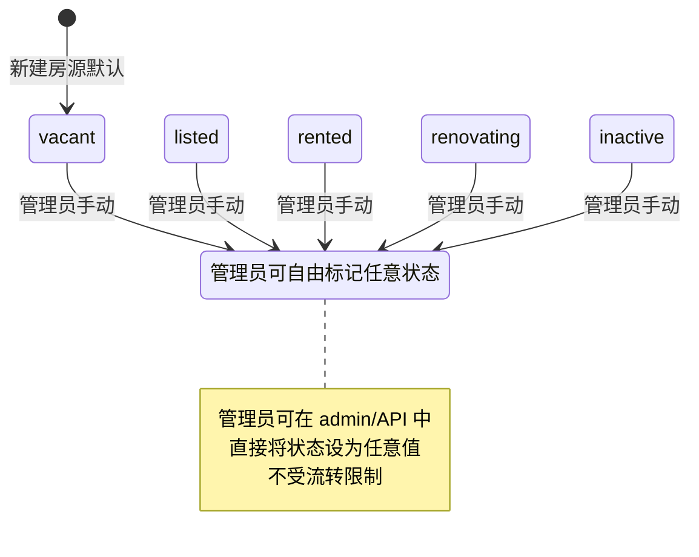
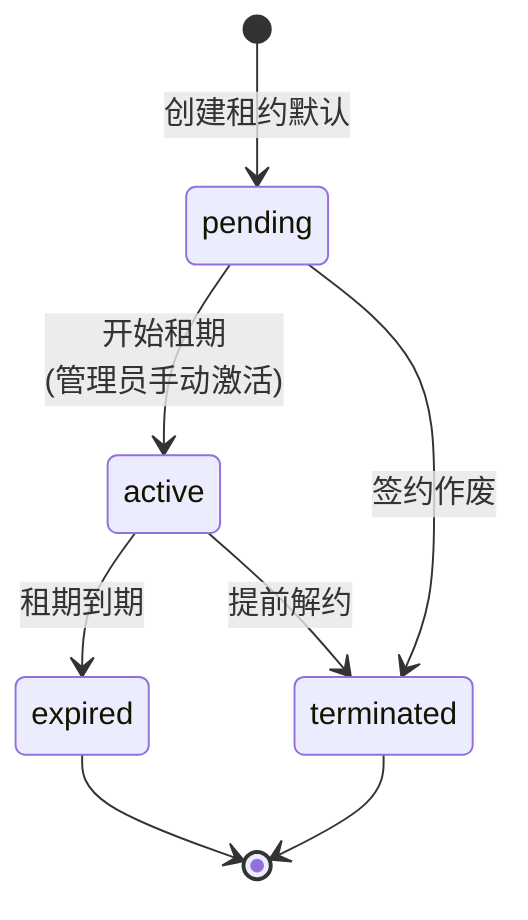
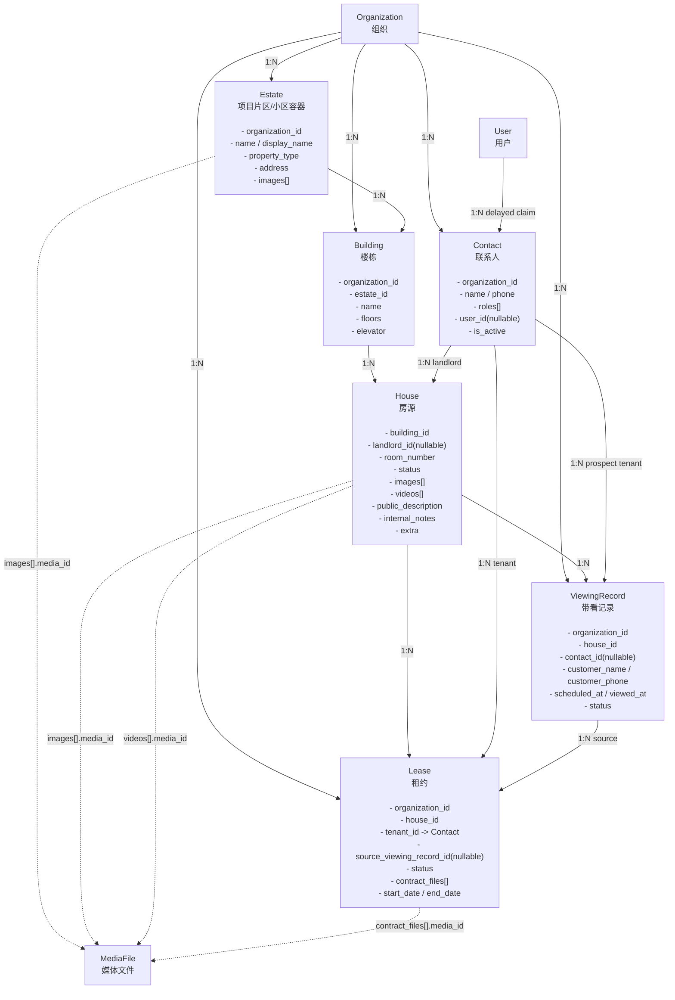
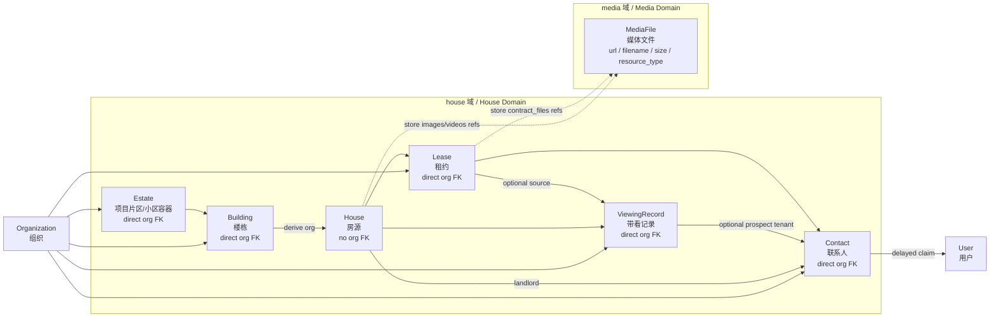
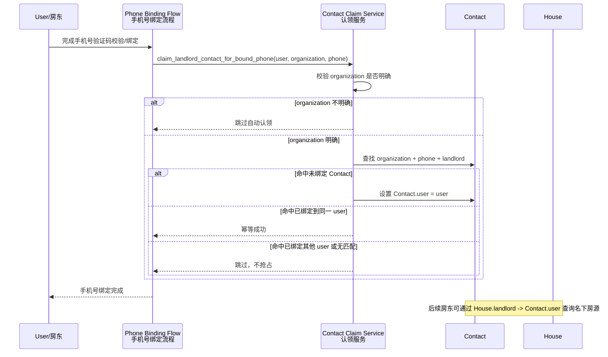

## Context

项目采用 Django 5 + django-ninja 架构，已有 `apps/accounts/`（User 模型）、`apps/organizations/` 等 app。本次新增房源出租管理数据层，建立空间层级 + 人员 + 登记出租方绑定 + 轻量带看 + 租约的完整闭环，为后续 ninja API 和前端 SPA 提供数据基础。

## Goals / Non-Goals

**Goals:**
- 建立 6 张模型：Estate / Building / House / Contact / ViewingRecord / Lease
- 顶层空间模型与核心业务事实建立清晰组织归属，其中 House 通过 `Building -> Estate` 推导组织边界
- Estate 与 Building 都有定位字段，但分别承载“项目级定位”和“楼栋级定位”
- Contact 支持延迟关联 User（房东注册时通过手机号自动认领）
- House 通过 `landlord` 实现房源与房东的绑定，支持房东视角查询
- House 图片/视频配置和 Lease 合同文件复用现有 `apps.media.MediaFile` 文件登记表，并用 `MediaRefsField` 保存稳定媒体引用
- House.status 作为唯一房源经营状态，由人工或显式业务操作维护；Lease 仅保留签约记录关系
- 用数据库约束兜底关键唯一性与数据合法性
- 注册 Django admin，生成完整 migrations

**Non-Goals:**
- 不包含 ninja API（后续单独 change）
- 不包含前端页面
- 不包含 LeaseRenewal、PaymentRecord（后续迭代）
- 不包含出售相关字段
- 不包含租金账单、付款流水、催收流程
- 不包含完整 CRM 线索池、渠道归因、跟进任务和佣金结算流程

## Model Field Reference / 模型字段参考

### Estate — 项目片区/小区容器

| # | 字段 | 类型 | 约束 / 默认值 | 说明 |
|---|------|------|---------------|------|
| 1 | organization | FK→Organization | | 所属组织 |
| 2 | name | str | 组织内唯一 | 片区名称 |
| 3 | display_name | str | | 展示名称 |
| 4 | developer | str | null=True, blank=True | 开发商（城中村可空） |
| 5 | built_year | int | null=True, blank=True | 竣工年份 |
| 6 | property_type | choices | residential / commercial / industrial / mixed | 物业类型 |
| 7 | province | str | | 省 |
| 8 | city | str | | 市 |
| 9 | district | str | | 区 |
| 10 | address | str | | 详细地址 |
| 11 | lat | DecimalField | null=True, blank=True | 纬度（项目级定位） |
| 12 | lng | DecimalField | null=True, blank=True | 经度（项目级定位） |
| 13 | images | MediaRefsField[list[dict]] | default=list, 上限 9 | 项目图片媒体引用列表，首张为封面 |
| 14 | description | TextField | blank=True | 项目介绍 |

唯一约束：`(organization, name)`

组织归属：直接 FK → `Organization`

### Building — 楼栋

| # | 字段 | 类型 | 约束 / 默认值 | 说明 |
|---|------|------|---------------|------|
| 1 | organization | FK→Organization | | 所属组织 |
| 2 | estate | FK→Estate | on_delete=PROTECT | 所属项目片区 |
| 3 | name | str | 片区内唯一 | 楼栋名称 |
| 4 | floors | int | | 地上楼层总数 |
| 5 | under_floors | int | null=True, blank=True | 地下楼层总数 |
| 6 | year_built | int | null=True, blank=True | 建成年份 |
| 7 | elevator | bool | default=False | 是否有电梯 |
| 8 | lat | DecimalField | null=True, blank=True | 纬度（楼栋级精确定位） |
| 9 | lng | DecimalField | null=True, blank=True | 经度（楼栋级精确定位） |
| 10 | address | str | blank=True | 楼栋详细地址 |

唯一约束：`(estate, name)`

一致性约束：`Building.organization == Estate.organization`

### House — 房源

| # | 字段 | 类型 | 约束 / 默认值 | 说明 |
|---|------|------|---------------|------|
| 1 | building | FK→Building | on_delete=PROTECT | 所属楼栋 |
| 2 | landlord | FK→Contact | null=True, blank=True, on_delete=PROTECT | 登记出租方（业主或二房东），签约前必须补齐 |
| 3 | room_number | str | 楼栋内唯一 | 房号（自由格式） |
| 4 | floor | int | null=True, blank=True | 所在楼层 |
| 5 | area | DecimalField | null=True, blank=True | 建筑面积（m²） |
| 6 | interior_area | DecimalField | null=True, blank=True | 套内面积（m²） |
| 7 | bedrooms | int | null=True, blank=True | 卧室数 |
| 8 | living_rooms | int | null=True, blank=True | 客厅数 |
| 9 | bathrooms | int | null=True, blank=True | 卫生间数 |
| 10 | kitchens | int | null=True, blank=True | 厨房数 |
| 11 | balconies | int | null=True, blank=True | 阳台数 |
| 12 | orientation | choices | south / north / east / west / south_north / east_west, null=True | 朝向 |
| 13 | decoration | choices | raw（毛坯）/ simple（简装）/ fine（精装）/ luxury（豪装）, null=True | 装修状况 |
| 14 | has_elevator_access | bool | default=False | 房源是否可直接使用电梯 |
| 15 | status | choices | vacant / listed / rented / renovating / inactive, default=vacant | 唯一经营状态，由人工或显式业务操作维护 |
| 16 | images | MediaRefsField[list[dict]] | default=list, 上限 9, 首张为封面 | 房源图片媒体引用列表 |
| 17 | videos | MediaRefsField[list[dict]] | default=list, 上限 3 | 房源视频媒体引用列表 |
| 18 | tags | JSONField[list[str]] | default=list | 灵活标签 |
| 19 | public_description | TextField | blank=True | 对外描述（所有用户可见） |
| 20 | internal_notes | TextField | blank=True | 内部描述（租户内成员可见） |
| 21 | extra | JSONField[dict] | default=dict | 动态扩展（备注、密码等） |

唯一约束：`(building, room_number)`

组织归属：通过 `building.estate.organization` 推导，本表不存 `organization` FK

一致性约束：`landlord.organization == building.estate.organization`（当 landlord 非空时）

### Contact — 联系人

| # | 字段 | 类型 | 约束 / 默认值 | 说明 |
|---|------|------|---------------|------|
| 1 | organization | FK→Organization | | 所属组织 |
| 2 | name | str | | 姓名 |
| 3 | phone | str | 组织内唯一 | 手机号 |
| 4 | email | str | blank=True | 邮箱（可选） |
| 5 | roles | JSONField[list[str]] | landlord / tenant，可多选 | 角色 |
| 6 | user | FK→User | null=True, blank=True | 关联用户（延迟认领） |
| 7 | notes | TextField | blank=True | 备注（租户内成员可见） |
| 8 | is_active | bool | default=True | 是否启用 |

唯一约束：`(organization, phone)`

延迟认领规则：用户绑定手机号后，系统在当前组织内查找 `phone` 匹配、`user is null`、含 `landlord` 角色的 Contact，自动设置 `user`。不跨组织、不抢占已有绑定、同用户幂等。

### ViewingRecord — 带看记录

| # | 字段 | 类型 | 约束 / 默认值 | 说明 |
|---|------|------|---------------|------|
| 1 | organization | FK→Organization | | 所属组织 |
| 2 | house | FK→House | on_delete=PROTECT | 带看的房源 |
| 3 | contact | FK→Contact | null=True, blank=True, on_delete=PROTECT | 已建档的意向租客，可空 |
| 4 | customer_name | str | | 临时客户姓名 |
| 5 | customer_phone | str | | 临时客户手机号 |
| 6 | scheduled_at | DateTimeField | | 预约带看时间 |
| 7 | viewed_at | DateTimeField | null=True, blank=True | 实际带看时间 |
| 8 | status | choices | scheduled / viewed / canceled / no_show / converted, default=scheduled | 带看状态 |
| 9 | assigned_to | FK→User | null=True, blank=True, on_delete=SET_NULL | 负责中介/员工 |
| 10 | notes | TextField | blank=True | 带看备注 |
| 11 | extra | JSONField[dict] | default=dict | 动态扩展 |
| 12 | is_active | bool | default=True | 是否启用 |

组织归属：直接 FK → `Organization`

一致性约束：
- `ViewingRecord.organization == house.building.estate.organization`
- `contact.organization == ViewingRecord.organization`（当 contact 非空时）

业务边界：ViewingRecord 只做后台带看记录，不承担完整 CRM 线索池、跟进任务、渠道归因或佣金结算。

### Lease — 租约

| # | 字段 | 类型 | 约束 / 默认值 | 说明 |
|---|------|------|---------------|------|
| 1 | organization | FK→Organization | | 所属组织 |
| 2 | house | FK→House | on_delete=PROTECT | 关联房源 |
| 3 | tenant | FK→Contact | on_delete=PROTECT | 租客（须具备 tenant 角色） |
| 4 | source_viewing_record | FK→ViewingRecord | null=True, blank=True, on_delete=PROTECT | 成交来源带看记录 |
| 5 | sign_at | DateTimeField | null=True, blank=True | 签约时间 |
| 6 | start_date | DateField | | 租期开始 |
| 7 | end_date | DateField | | 租期结束（须 ≥ start_date） |
| 8 | monthly_rent | DecimalField | | 月租金（须 ≥ 0） |
| 9 | deposit | DecimalField | null=True, blank=True | 押金（须 ≥ 0） |
| 10 | payment_day | int | default=1, 范围 1-31 | 每月付款日 |
| 11 | status | choices | pending / active / expired / terminated, default=pending | 租约状态 |
| 12 | contract_files | MediaRefsField[list[dict]] | default=list, 上限 1 | 租约合同媒体引用列表 |
| 13 | notes | TextField | blank=True | 备注 |
| 14 | extra | JSONField[dict] | default=dict | 动态扩展（费用、押金条目等后续账单子域预留） |

唯一约束：同一 `house` 仅允许一条 `status='active'` 的 Lease（数据库级条件唯一约束）

一致性约束：
- `Lease.organization == house.building.estate.organization == tenant.organization`
- `house.landlord` 必须非空时才允许创建 Lease
- 当 `source_viewing_record` 非空时，必须属于同 organization、同 House、状态为 `converted`；若其 `contact` 非空，还必须等于 `tenant`

房态关系：Lease 仅关联 House 用于记录和追溯，不因新增、更新、到期、迁移或删除自动修改 `House.status`

---

## Choice Enums / 选项枚举定义

### Estate.property_type

| 值 | 中文 | 说明 |
|----|------|------|
| residential | 住宅 | 普通住宅小区 |
| commercial | 商业 | 写字楼、商铺 |
| industrial | 工业 | 厂房、仓储 |
| mixed | 综合 | 商住两用或多业态混合 |

### House.orientation

| 值 | 中文 | 说明 |
|----|------|------|
| south | 南 | 朝南 |
| north | 北 | 朝北 |
| east | 东 | 朝东 |
| west | 西 | 朝西 |
| south_north | 南北 | 南北通透 |
| east_west | 东西 | 东西向 |

### House.decoration

| 值 | 中文 | 说明 |
|----|------|------|
| raw | 毛坯 | 未装修 |
| simple | 简装 | 基础装修 |
| fine | 精装 | 中高档装修 |
| luxury | 豪装 | 豪华装修 |

### House.status — 房态（见下方状态机）

| 值 | 中文 | 说明 |
|----|------|------|
| vacant | 空置 | 当前空置，尚未进入对外招租 |
| listed | 招租中 | 当前空置且正在对外招租 |
| rented | 已租 | 运营人员确认当前已经出租，不要求系统内存在租约 |
| renovating | 装修中 | 当前处于装修或整备阶段 |
| inactive | 已停用 | 不参与日常经营查询和统计 |

### Contact.roles

| 值 | 说明 |
|----|------|
| landlord | 房东/出租方（含业主、二房东） |
| tenant | 租客/承租方 |

单个 Contact 可同时具备多个角色（如既是 A 房的 landlord 又是 B 房的 tenant）。

### Lease.status — 租约状态（见下方状态机）

| 值 | 中文 | 说明 |
|----|------|------|
| pending | 待生效 | 租约已签但尚未到起租日 |
| active | 生效中 | 租期内 |
| expired | 已到期 | 租期自然结束 |
| terminated | 已终止 | 提前解约或签约后作废 |

### ViewingRecord.status — 带看状态

| 值 | 中文 | 说明 |
|----|------|------|
| scheduled | 已预约 | 已登记预约带看时间 |
| viewed | 已带看 | 已完成线下或线上带看 |
| canceled | 已取消 | 客户或中介取消 |
| no_show | 爽约 | 到点未带看成功 |
| converted | 已成交 | 该带看最终转为租约 |

---

## State Machine / 状态机

### House.status 状态机

House.status 是独立运营状态。允许管理员或显式业务操作直接设置为任意合法状态，不受租约状态驱动。例如可将 vacant 直接标为 rented，也可在租约到期后根据实际交接情况继续保留 rented。



**规则**：

- 允许任意状态切换，不受方向限制，后端只校验目标状态属于合法枚举值
- Lease 与 House.status 是弱关系，Lease 激活、到期、终止、迁移和删除都不触发房态变更
- House.status 与 Lease.status 可能暂时不一致，以实际运营确认结果为准
- 租约仍保留 House 外键，以支持记录查询、历史追溯和同房源 active 租约唯一约束

### Lease.status 状态机



**规则**：

- `pending` 是新建租约的初始状态
- `pending → active` 由管理员或明确的租约流程触发，不修改 House.status
- `pending → terminated` 表示签约后作废（如租客反悔），不修改 House.status
- `active → expired` 表示租期自然结束，仅更新租约记录，不修改 House.status
- `active → terminated` 表示提前解约（如双方协议退租、违约退租），不修改 House.status
- `expired` 和 `terminated` 是终态，不可再流转
- 禁止逆向流转：`active → pending`、`expired → active`、`terminated → active` 均不允许

---

## Domain Flow

本 change 的业务闭环固定为：

```
Organization
  -> Estate
    -> Building
      -> House
        -> landlord -> Contact(role=landlord) -> User(延迟认领)
        -> ViewingRecord -> Contact(role=tenant, optional)
        -> Lease -> Contact(role=tenant)
        -> Lease.source_viewing_record -> ViewingRecord(status=converted, optional)
        -> Lease.contract_files[] -> MediaFile (合同)
        -> images[] -> MediaFile (图片)
        -> videos[] -> MediaFile (视频)
        -> status(独立运营维护)
```

其中：
- `Estate / Building / House` 是空间资产主数据，只回答“房子在哪里、长什么样、是否可运营”
- `House.landlord` 表示房源登记出租方，不表示当前出租关系
- `ViewingRecord` 表示后台中介录入的预约、带看、取消、爽约和成交记录，不表示租赁事实
- `Lease` 表示当前或历史租赁事实，用于记录和追溯
- `status` 是面向查询与运营筛选的独立快照，不由 Lease 自动推导

这样可以在第一版就把“建档 -> 认领 -> 带看 -> 出租 -> 退租”闭合起来，同时避免把账单、续租、催收、线索池等后续子域过早耦合进主模型

## Data Model Diagrams

### 图 1：完整实体关系图 / Full Entity Relationship Diagram



### 图 2：组织归属与媒体边界图 / Organization & Media Boundary



### 图示说明 / Notes

- `Estate / Building / Contact / ViewingRecord / Lease` 都直接带 `organization_id`。
- `House` 不带 `organization_id`，组织归属只能通过 `House -> Building -> Estate -> Organization` 推导。
- `House.landlord` 是单字段绑定，当前版本只支持“单一登记出租方 / single registered landlord”，且允许为空。
- `Estate.images[]`、`House.images[]`、`House.videos[]` 与 `Lease.contract_files[]` 保存业务媒体引用对象，每项至少包含 `media_id`，可包含 `media_type`、`label`、`image_role`、`room` 等业务字段。
- 媒体 URL、文件名、大小、缩略图等展示信息必须通过 `MediaRefsField` 的 `<field>_resolved` 只读属性或 `apps.media.services.resolve_media_refs()` 回显，`house` 域不自行拼接文件地址，也不保存增强后的展示数据。

## Decisions

### 1. 新建独立 app `apps/house/`

**选择**：新建独立 app。

**理由**：房源出租是独立业务域，边界清晰，便于后续扩展 API、Celery 任务、信号等。

### 2. 顶层空间模型与核心业务事实建立组织归属

**选择**：`Estate / Building / Contact / ViewingRecord / Lease` 直接带 `organization` FK；`House` 不直接保存 `organization`，通过 `house.building.estate.organization` 推导归属。

**理由**：项目已有组织维度的权限和上下文，请求期有 `request.org`。对顶层空间模型和核心业务事实显式建立组织边界，可以让 admin、后续 API、唯一约束和查询逻辑保持一致；而 House 作为楼栋下的自然从属对象，可通过 Building/Estate 链路推导，减少一层机械冗余。

### 3. Estate 与 Building 分层承载定位信息

**选择**：
- `Estate` 保存项目/小区/片区级的位置与地址信息：`province/city/district/address/lat/lng`
- `Building` 也保存楼栋级精确定位：`lat/lng`，并可补楼栋详细地址 `address`
- `House` 当前不单独保存定位，默认继承 `Building` 的定位语义

**语义约定**：
- `Estate.lat/lng` 表示项目中心点、片区中心点或小区级展示点
- `Building.lat/lng` 表示单栋楼的精确定位，优先用于带看、导航、上门、维修等实际操作
- 对大型小区，地图列表可先展示 `Estate`，进入楼栋/带看场景后使用 `Building`
- 对城中村或分散式楼栋场景，业务操作应以 `Building` 定位为主，即便它们仍归在某个 `Estate` 容器下

**理由**：单靠 `Estate` 定位无法覆盖“大型小区不同楼栋相距较远”或“城中村片区内多栋散楼”的现实场景；而完全去掉 `Estate` 又会丢失片区聚合、统一介绍和项目展示能力。分层建模能同时保留项目聚合和楼栋精度。

### 4. 跨模型 organization 一致性作为业务硬约束

**选择**：除保存 `organization` 外，还要求关联链路中的组织必须一致：

```
Building.organization == Estate.organization
House.organization is derived from Building -> Estate
House.landlord.organization == House.building.estate.organization  (when landlord is set)
Lease.organization == House.building.estate.organization == tenant.organization
ViewingRecord.organization == House.building.estate.organization
ViewingRecord.contact.organization == ViewingRecord.organization  (when contact is set)
```

**理由**：仅“部分表有 organization 字段”还不足以防止串租户数据。把组织一致性提升为模型校验和测试要求，才能真正保证后续 admin、API、房东查询都不会读到逻辑上越界的数据。

### 5. Contact 统一管理房东和租客，支持延迟关联 User

**选择**：
```
Contact
  organization: FK→Organization
  roles: landlord / tenant（可同时具备）
  user: FK→User, null=True
  phone: 组织内唯一
```

**延迟关联流程**：
1. 中介创建 Contact(landlord)，user=null
2. 房东注册或绑定手机号完成后，系统查 `Contact.objects.filter(organization=当前组织, phone=注册手机号, user__isnull=True)`
3. 找到则自动关联 `Contact.user = 新建User`

**理由**：统一 Contact 表避免 Landlord/Tenant 分表冗余；联系人在真实业务里可能既是房东又是租客，因此角色不应强制互斥；手机号只在组织内唯一，避免跨组织录入冲突。

### 6. House 直接关联单一登记出租方

**选择**：在 `House` 上直接保存 `landlord = ForeignKey(Contact, null=True, blank=True, on_delete=PROTECT)`。

**版本边界**：当前版本仅支持“单一登记出租方”。这里的 `landlord` 可以表示业主或二房东。若后续出现共有产权、多出租方、复杂委托链等场景，不在本 change 内继续给 `House.landlord` 打补丁解决，而应升级为单独的多主体建模方案。

**理由**：MVP 阶段出租方登记只是 House 的一个直接属性，没有独立生命周期、历史、附件或多人关系需求。直接挂在 House 上可以减少一张表、一层 join 和一组一致性维护成本。

**管理员流程优化**：
- 创建 House 时，管理员应可直接“选择已有 landlord Contact”或“同页快速新建 landlord Contact”，避免先去 Contact 页面建档、再回到 House 页面绑定的往返操作
- `House.landlord` 允许为空，因此管理员可以先完成最小房源建档
- 但进入签约动作前，必须先补齐 `landlord`，不允许对“未登记出租方”的 House 创建 Lease

**推荐管理员闭环**：
1. 创建 House，并直接选择或新建 landlord Contact
2. 若暂时缺资料，可先保存为“未登记出租方”的空房
3. 上架、维护图片、带看
4. 租客确认承租时，若 `landlord` 为空，先补齐登记出租方
5. 再创建 Lease；如实际运营需要，同时通过房源维护入口显式调整房态

这样既缩短了管理员操作链路，也避免出现“租约已签但房东归属仍为空”的不完整数据状态。

### 7. 房东视角通过 House.landlord -> Contact.user 推导

**选择**：房东可见范围不直接挂在 `User` 上，而是通过 `House.landlord -> Contact.user` 反查：

```
House.objects.filter(
    building__estate__organization=request.org.instance,
    landlord__user=request.user,
)
```

后续房东端查询 House、Lease 时，都以这条链路作为事实来源。

**理由**：房东账号是延迟认领的，User 不是房源的天然主键。用 `House.landlord -> Contact.user` 推导既符合业务事实，也避免在 House 上再冗余 `owner_user` 一类字段。

### 8. Contact 认领流程采用“组织内匹配、未绑定优先、已绑定不抢占”

**选择**：
- Contact 认领必须收口到统一服务入口，例如 `claim_landlord_contact_for_bound_phone(user, organization, phone)`
- 该入口只在“手机号已成功绑定/确认”之后触发，不在散落的注册表单、登录分支、页面回调中直接改 `Contact.user`
- 触发来源可以包括：注册完成手机号确认、已登录用户补绑手机号、第三方登录后补绑手机号、用户换绑新手机号
- 自动认领只在“当前 organization”内生效，不跨组织扫描或迁移 Contact
- 只有 `user is null` 且包含 `landlord` 角色的 Contact 才能被自动认领
- 若匹配 Contact 已绑定其他 User，则跳过自动认领，不做抢占或覆盖
- 若同一 User 重复完成手机号绑定，且命中已绑定到自己的 Contact，则视为幂等成功，不重复创建或改绑
- 若 User 后续变更手机号，仅对“新手机号 + 当前 organization + user is null”的 Contact 尝试自动认领；已有 Contact.user 绑定关系不因手机号变化自动解除
- 若当前流程无法明确 organization 上下文，则本次不自动认领，待进入明确组织上下文的手机号绑定流程后再尝试

**推荐时序**：



**理由**：认领流程真正复杂的不是首绑，而是重复绑定、换号、跨组织重号。明确“不抢占、不跨组织、可幂等”三条规则，可以把自动化范围控制在安全区内，把歧义留给人工处理。

### 9. House.status 与 Lease 保持弱关系

**选择**：House 上保留独立的 `status` 运营字段，Lease 上保留 House 外键用于查询与历史追溯，但两者不建立自动状态同步。

- Lease 新增、激活、到期、终止、迁移或删除均不修改 House.status
- House.status 只能通过房源维护接口或其他明确的运营动作修改
- 不注册 Lease 保存、删除信号，也不提供从 Lease 自动重算房态的服务入口
- 允许 House.status 与 Lease.status 暂时不一致，以反映退租交接、清退、装修或线下出租等实际业务过程

**理由**：系统无法保证所有线下签约都录入 Lease，因此 Lease 不能作为房态真相来源。将 House.status 作为独立经营快照，可支持线下出租、退租交接、清退和装修等实际业务过程。

### 10. Estate、House 图片与 House 视频采用有序媒体引用对象列表

**选择**：参考 `docs/media-platform.md` 的最佳实例，不单独创建图片/视频关系表，而是在 `Estate` 与 `House` 上使用 `MediaRefsField` 保存有序媒体引用对象列表。字段名采用业务语义：`images` / `videos`，每个列表项至少包含 `media_id`，可选包含 `media_type`，业务扩展字段直接平铺。

`Estate.images` 示例：

```json
[
  {
    "media_id": 101,
    "media_type": "image",
    "label": "项目封面",
    "image_role": "cover"
  },
  {
    "media_id": 102,
    "media_type": "image",
    "label": "园区环境",
    "image_role": "gallery"
  }
]
```

`House.images` 示例：

```json
[
  {
    "media_id": 35,
    "media_type": "image",
    "label": "房源封面",
    "image_role": "cover"
  },
  {
    "media_id": 12,
    "media_type": "image",
    "label": "客厅实拍",
    "image_role": "gallery",
    "room": "living_room"
  }
]
```

`House.videos` 示例：

```json
[
  {
    "media_id": 201,
    "media_type": "video",
    "label": "房源视频",
    "video_role": "tour"
  }
]
```

分别对应 `Estate.images`、`House.images`、`House.videos` 三个 `MediaRefsField` 列表字段。

约定：
- `images` 与 `videos` 都允许为空列表，空列表表示"暂无对应媒体"
- 每个 item 必须包含 `media_id`，对应 `MediaFile.id`
- `media_type` 推荐保留，图片为 `image`，视频为 `video`
- `label`、`image_role`、`video_role`、`room` 等字段属于 house 业务字段，不进入 `MediaFile`，不额外包 `meta`
- 图片列表默认上限为 9 张；视频列表默认上限为 3 个
- 列表顺序即展示顺序
- 第一张图片即封面图；也允许通过 `image_role=cover` 显式标记封面，但二者冲突时以列表第一项为准
- `Estate.images` 中的每个 `media_id` 都必须指向 `ResourceType.ESTATE_IMAGE` 的 `MediaFile`
- `House.images` 中的每个 `media_id` 都必须指向 `ResourceType.HOUSE_IMAGE` 的 `MediaFile`
- `House.videos` 中的每个 `media_id` 都必须指向 `ResourceType.HOUSE_VIDEO` 的 `MediaFile`
- 同一房源的图片或视频列表中不允许重复 `media_id`
- 同一个 `MediaFile` 允许被多个房源引用，不做跨房源唯一限制
- 图片/视频说明文字使用业务字段 `label`，不写入 `MediaFile`

**保存约定**：`MediaRefsField` 自动调用平台校验逻辑清洗稳定引用，剔除 `url`、`resource_type`、`original_filename`、`thumbnail`、`file_size`、`created_at` 等平台派生字段；业务层继续负责组织权限、数量上限之外的业务语义校验。

**API 读取约定**：`house` 域在 API 层返回房源或项目详情时，优先使用 `images_resolved` / `videos_resolved` 只读属性；必要时也可显式调用 `apps.media.services.resolve_media_refs()`，返回平铺增强后的列表。平台补充 `url`、`thumbnail`、`original_filename`、`file_size`、`created_at` 等展示字段，并保持业务原始顺序。存储层只保存稳定的业务媒体引用列表，不保存增强后的 URL 数据。

**理由**：当前版本对项目图和房源图的核心诉求是“挂图、排序、封面、业务标签”。用平铺媒体引用对象能保留 `apps.media` 的通用能力，同时让房源域自行表达 `label`、`image_role`、`room` 等业务语义，避免把房源字段塞进媒体基础层。

### 11. 关键一致性优先用数据库约束兜底

**选择**：
- 同一 `organization` 下 `Estate.name` 唯一
- 同一 `estate` 下 `Building.name` 唯一
- 同一 `building` 下 `House.room_number` 唯一
- 同一 `organization` 下 `Contact.phone` 唯一
- 同一 `house` 仅允许一条 `status='active'` 的 Lease

**理由**：`clean()` 适合业务提示，但并发场景仍需数据库保证最终一致性。

### 12. 带看采用轻量记录表，不扩展完整 CRM

**选择**：新增 `ViewingRecord` 表，只记录后台中介围绕某套房的带看过程：

```
ViewingRecord
  organization: FK→Organization
  house: FK→House
  contact: FK→Contact | null
  customer_name / customer_phone
  scheduled_at / viewed_at
  status: scheduled / viewed / canceled / no_show / converted
  assigned_to: FK→User | null
  notes / extra / is_active
```

**流程约定**：
1. 客户预约或中介录入带看时，创建 `ViewingRecord(status=scheduled)`，可只填写临时客户姓名和手机号
2. 如果客户已建档，可关联 `contact`，且该 Contact 应属于同一组织并建议具备 `tenant` 角色
3. 带看完成后标记为 `viewed`，取消标记为 `canceled`，未到场标记为 `no_show`
4. 客户确认承租时，管理员显式创建或选择 `Contact(role=tenant)`，再创建 `Lease`
5. 相关带看记录可标记为 `converted`，仅作为来源记录，不自动创建租约

**边界**：V1 不提供线索池、渠道归因、多次跟进任务、佣金结算或销售漏斗统计。若后续需要这些能力，应独立设计 CRM/销售流程模块，而不是继续往 `ViewingRecord` 里堆字段。

**理由**：直接从 `House -> Lease` 虽然能完成后台录入，但中介日常会自然产生“谁预约了、谁看过、谁爽约、谁成交”的过程记录。用单张轻量表可以补上签约前的运营闭环，同时避免把 MVP 拉成完整 CRM。

### 13. 房源媒体和租约合同复用 `apps/media`

**选择**：不在 `apps/house` 中直接定义 `ImageField` / `FileField`，也不保存裸 `url`；固定媒体字段统一使用 `MediaRefsField`，通过业务媒体引用对象里的 `media_id` 引用对象存储中的 `MediaFile`。

```
Estate
  images: MediaRefsField[list[dict]]

House
  images: MediaRefsField[list[dict]]
  videos: MediaRefsField[list[dict]]

Lease
  sign_at: DateTimeField | null
  contract_files: MediaRefsField[list[dict]]
  extra: JSONField[dict]
```

**上传流程**：
1. 前端或后续 API 使用 `apps/media` 获取组织作用域上传路径，`scope=org`，`object_id=Organization.pk`
2. 文件上传到 `S3MediaStorage` 管理的对象存储，本地开发落到 MinIO
3. 调用媒体确认接口登记 `MediaFile`
4. 更新 `Estate.images` / `House.images` / `House.videos` / `Lease.contract_files`，保存包含 `media_id` 的业务媒体引用对象

**保存规则**：固定媒体字段使用 `MediaRefsField` 声明 `max_items`、`allowed_media_types`、`allowed_resource_types`，由字段层调用 `apps.media.services.validate_media_refs()` 校验 `media_id` 是否存在、是否重复并清洗派生字段；`house` 域继续在 service/API 层校验当前用户是否允许使用这些组织媒体。若只需要提取 ID，可使用 `extract_media_ids()`。

**读取规则**：`house` 域只保存媒体引用对象及其顺序，不负责自行拼装 URL 或复制媒体元信息。API 层返回详情时，优先读取 `images_resolved` / `videos_resolved` / `contract_files_resolved`；如需显式解析，则调用 `resolve_media_refs()`。展示层字段由 media app 动态填充，业务字段由 house 域保留。

**媒体类型**：
- 项目图片使用 `ResourceType.ESTATE_IMAGE`，允许 `jpg` / `jpeg` / `png` / `webp`
- 房源图片使用 `ResourceType.HOUSE_IMAGE`，允许 `jpg` / `jpeg` / `png` / `webp`
- 房源视频使用 `ResourceType.HOUSE_VIDEO`，允许 `mp4` / `mov` / `avi`
- 租约合同使用 `ResourceType.LEASE_CONTRACT`，至少允许 `pdf`；若业务需要可扩展 `doc` / `docx`

**归属边界**：`MediaFile` 只负责文件元数据和对象存储路径，业务归属仍以 `House.building.estate.organization` / `Lease.organization` 为准。后续 API 在绑定 `media_file` 时必须校验当前用户属于该组织，并优先使用、校验 `uploads/orgs/<organization_id>/...` 路径。

**引用清理**：`Estate.images`、`House.images`、`House.videos`、`Lease.contract_files` 均使用 `MediaRefsField`，由媒体平台自动扫描收集引用，不需要为这些固定字段手写 `MEDIA_REFERENCE_PROVIDERS`。只有后续把媒体引用放进 `extra` 这类动态 JSON 或普通 `JSONField` 时，才需要额外提供 provider。

**删除策略**：删除 `House` 时不再有房源图片关系表需要级联删除；`MediaFile` 及对象存储中的文件不在本 change 中物理删除，避免误删仍被其他业务引用的文件。后续可通过媒体清理任务处理孤儿文件。

**理由**：项目已经有 `MediaFile.file = FileField(storage=S3MediaStorage())`、直传确认和服务端上传能力。复用这一层可以统一 MinIO/S3 URL 生成、上传审计、文件元数据和后续权限控制，避免房源域单独维护一套文件存储规则。

### 14. 租约只限制 active 并发，不额外限制时间重叠

**选择**：当前版本只保证“同一套房同一时间只有一条 `active` 租约”，不额外校验 `pending`、历史租约或未来租约在时间区间上的重叠。

**理由**：V1 的重点是租约记录和运营闭环，不是完整的排班式时段编排。把限制收敛到 `active` 并发，能降低实现复杂度，也避免把历史脏数据修复逻辑提前塞进模型层。

### 15. 删除策略遵循“删业务关联，不直接删物理文件”

**选择**：
- `Estate / Building / House` 继续使用 `PROTECT` 守住层级完整性
- `MediaFile` 与对象存储文件不在本 change 中随业务记录物理删除

**理由**：房源域第一版优先保证可审计和不误删。统一媒体清理应交给后续孤儿文件清理任务，而不是在业务删除时做激进回收。

## Risks / Trade-offs

- [状态不一致] House.status 与 Lease.status 允许不同步 → 界面明确分别展示房态与租约状态，房态只通过显式运营动作修改
- [手机号认领边界] 项目同时存在手机注册、验证码登录、微信绑定手机号 → 后续实现需把 Contact 自动认领挂到统一手机号绑定流程
- [自动认领误绑定] 若换号、重复绑定、跨组织重号时规则不清，可能出现错误认领 → 明确“仅当前组织、仅未绑定 Contact、已绑定不抢占、同用户幂等成功”
- [跨组织数据串读] 若后续 API 忘记按 organization 过滤会越权 → 第一版就建立组织外键和约束，减少漏过滤概率
- [组织不一致脏数据] 若 Building/House.landlord/Lease 不校验关联链一致性，后续房东查询可能出现同房异组织的脏记录 → 在模型 clean()、测试和 admin 保存路径中统一校验
- [带看记录膨胀为 CRM] 若 ViewingRecord 继续承接渠道、跟进、佣金等字段，会让模型边界失控 → 文档明确 V1 只做轻量带看记录，复杂销售流程后续独立建模
- [未来多主体扩展] 当前 `House.landlord` 单字段方案无法覆盖共有产权或多层委托 → 在文档中明确 V1 只支持单一登记出租方，后续通过独立多主体方案演进
- [媒体引用列表约束较弱] `MediaRefsField` 底层仍是 JSON 列表，数据库层无法像关系表那样精细约束封面与顺序 → 在字段参数、模型校验与测试中保证“首图为封面、无重复 media_id、只允许合法资源类型”
- [媒体列表长度失控] 若不限制图片数量，后台编辑和前端展示都可能变重 → 当前版本限制单套房源最多 9 张图、3 个视频
- [媒体孤儿文件] 从房源媒体引用列表移除 `media_id` 不直接删除 MediaFile 或对象存储文件 → 固定媒体字段通过 `MediaRefsField` 自动参与延迟清理引用收集，避免误删共享或误关联文件
- [合同扩展名] 当前媒体模块只允许图片扩展名 → 实现本 change 时需扩展 `MediaExtension` 和 `ResourceType`

## Migration Plan

1. 新建 `apps/house/` app，注册到 `INSTALLED_APPS`
2. 扩展 `apps/media` 的 `ResourceType`（新增 `ESTATE_IMAGE`、`HOUSE_IMAGE`、`HOUSE_VIDEO`、`LEASE_CONTRACT`）和合同文件扩展名
3. 按依赖顺序建模型：Estate → Building → Contact → House → ViewingRecord → Lease
4. 运行 `makemigrations house`
5. 为唯一约束、检查约束和条件唯一约束生成 migration
6. 确认 `MediaRefsField` 自动收集 Estate/House/Lease 固定媒体字段引用；当前无动态媒体 JSON provider
7. 注册 admin
8. 运行测试确认 migration 正常执行
