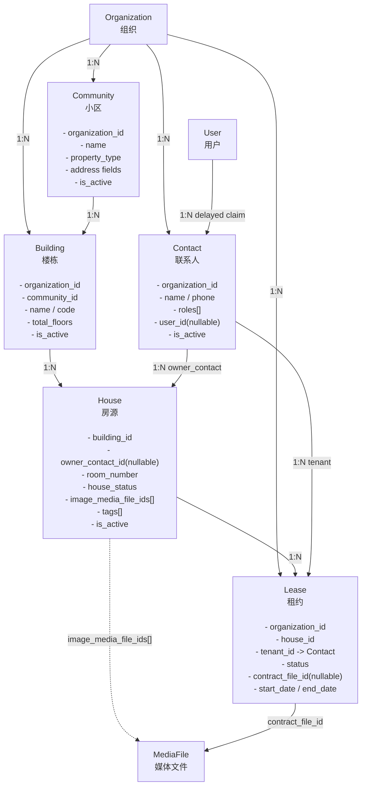
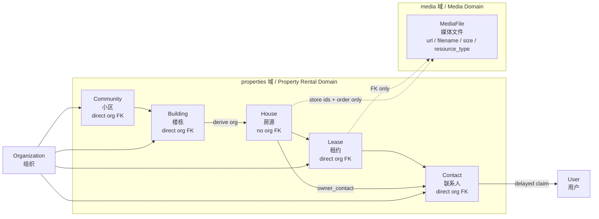
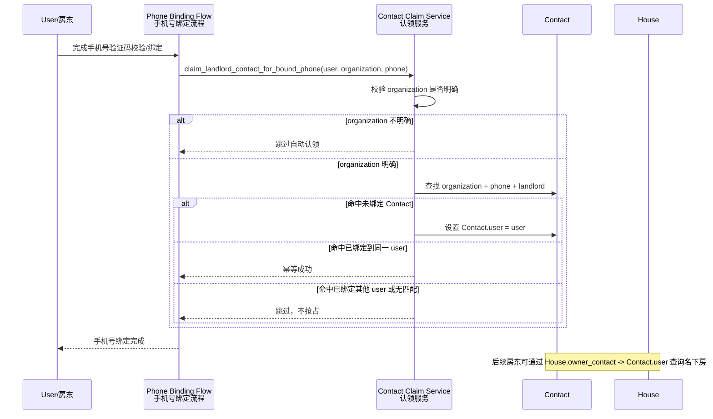

## Context

项目采用 Django 5 + django-ninja 架构，已有 `apps/accounts/`（User 模型）、`apps/organizations/` 等 app。本次新增房源出租管理数据层，建立空间层级 + 人员 + 登记房东绑定 + 租约的完整闭环，为后续 ninja API 和前端 SPA 提供数据基础。

## Goals / Non-Goals

**Goals:**
- 建立 5 张模型：Community / Building / House / Contact / Lease
- 顶层空间模型与核心业务事实建立清晰组织归属，其中 House 通过 `Building -> Community` 推导组织边界
- Contact 支持延迟关联 User（房东注册时通过手机号自动认领）
- House 通过 `owner_contact` 实现房源与房东的绑定，支持房东视角查询
- House 图片配置和 Lease 合同文件复用现有 `apps.media.MediaFile` 文件登记表
- House.house_status 作为冗余快照字段，真相来自 Lease 表
- 用数据库约束兜底关键唯一性与数据合法性
- 注册 Django admin，生成完整 migrations

**Non-Goals:**
- 不包含 ninja API（后续单独 change）
- 不包含前端页面
- 不包含 LeaseRenewal、PaymentRecord（后续迭代）
- 不包含出售相关字段
- 不包含租金账单、付款流水、催收流程

## Domain Flow

本 change 的业务闭环固定为：

```
Organization
  -> Community
    -> Building
      -> House
        -> owner_contact -> Contact(role=landlord) -> User(延迟认领)
        -> Lease -> Contact(role=tenant)
        -> image_media_file_ids[] -> MediaFile
        -> house_status(由 Lease 重算)
```

其中：
- `Community / Building / House` 是空间资产主数据，只回答“房子在哪里、长什么样、是否可运营”
- `House.owner_contact` 表示房源登记归属，不表示当前出租关系
- `Lease` 表示当前或历史租赁事实，是房态真相来源
- `house_status` 是面向查询与运营筛选的冗余快照，不是租赁真相来源

这样可以在第一版就把“建档 -> 认领 -> 出租 -> 退租”闭合起来，同时避免把账单、续租、催收等后续子域过早耦合进主模型

## Data Model Diagrams

### 图 1：完整实体关系图 / Full Entity Relationship Diagram



### 图 2：组织归属与媒体边界图 / Organization & Media Boundary



### 图示说明 / Notes

- `Community / Building / Contact / Lease` 都直接带 `organization_id`。
- `House` 不带 `organization_id`，组织归属只能通过 `House -> Building -> Community -> Organization` 推导。
- `House.owner_contact` 是单字段绑定，当前版本只支持“单一登记房东 / single registered landlord”，且允许为空。
- `House.image_media_file_ids[]` 只保存 `MediaFile` 的 id 和顺序，不保存 `url`、`caption` 等媒体详情。
- 图片与合同文件的展示信息必须复用 `apps.media` 能力解析，`properties` 域不自行拼接文件地址。

## Decisions

### 1. 新建独立 app `apps/properties/`

**选择**：新建独立 app。

**理由**：房源出租是独立业务域，边界清晰，便于后续扩展 API、Celery 任务、信号等。

### 2. 顶层空间模型与核心业务事实建立组织归属

**选择**：`Community / Building / Contact / Lease` 直接带 `organization` FK；`House` 不直接保存 `organization`，通过 `house.building.community.organization` 推导归属。

**理由**：项目已有组织维度的权限和上下文，请求期有 `request.org`。对顶层空间模型和核心业务事实显式建立组织边界，可以让 admin、后续 API、唯一约束和查询逻辑保持一致；而 House 作为楼栋下的自然从属对象，可通过 Building/Community 链路推导，减少一层机械冗余。

### 3. 地址字段内嵌于 Community，Building 不重复存地址

**选择**：省市区地址和坐标放在 Community，Building 只存楼栋自身属性。

**理由**：同一小区内所有楼栋地址相同，放 Community 避免重复；楼栋只需要名称、楼层数等自身信息。

### 4. 跨模型 organization 一致性作为业务硬约束

**选择**：除保存 `organization` 外，还要求关联链路中的组织必须一致：

```
Building.organization == Community.organization
House.organization is derived from Building -> Community
House.owner_contact.organization == House.building.community.organization  (when owner_contact is set)
Lease.organization == House.building.community.organization == tenant.organization
```

**理由**：仅“部分表有 organization 字段”还不足以防止串租户数据。把组织一致性提升为模型校验和测试要求，才能真正保证后续 admin、API、房东查询都不会读到逻辑上越界的数据。

### 5. Contact 统一管理房东和租客，支持延迟关联 User

**选择**：
```
Contact
  organization: FK→Organization
  roles: landlord / tenant（可同时具备）
  user: FK→User, null=True
  phone: 组织内唯一
```

**延迟关联流程**：
1. 中介创建 Contact(landlord)，user=null
2. 房东注册或绑定手机号完成后，系统查 `Contact.objects.filter(organization=当前组织, phone=注册手机号, user__isnull=True)`
3. 找到则自动关联 `Contact.user = 新建User`

**理由**：统一 Contact 表避免 Landlord/Tenant 分表冗余；联系人在真实业务里可能既是房东又是租客，因此角色不应强制互斥；手机号只在组织内唯一，避免跨组织录入冲突。

### 6. House 直接关联单一登记房东

**选择**：在 `House` 上直接保存 `owner_contact = ForeignKey(Contact, null=True, blank=True, on_delete=PROTECT)`。

**版本边界**：当前版本仅支持“单一登记房东”。若后续出现共有产权、夫妻共同持有、法人/自然人共同持有等场景，不在本 change 内继续给 `House.owner_contact` 打补丁解决，而应升级为单独的多业主建模方案。

**理由**：MVP 阶段房东登记只是 House 的一个直接属性，没有独立生命周期、历史、附件或多人关系需求。直接挂在 House 上可以减少一张表、一层 join 和一组一致性维护成本。

### 7. 房东视角通过 House.owner_contact -> Contact.user 推导

**选择**：房东可见范围不直接挂在 `User` 上，而是通过 `House.owner_contact -> Contact.user` 反查：

```
House.objects.filter(
    building__community__organization=request.org.instance,
    owner_contact__user=request.user,
)
```

后续房东端查询 House、Lease 时，都以这条链路作为事实来源。

**理由**：房东账号是延迟认领的，User 不是房源的天然主键。用 `House.owner_contact -> Contact.user` 推导既符合业务事实，也避免在 House 上再冗余 `owner_user` 一类字段。

### 8. Contact 认领流程采用“组织内匹配、未绑定优先、已绑定不抢占”

**选择**：
- Contact 认领必须收口到统一服务入口，例如 `claim_landlord_contact_for_bound_phone(user, organization, phone)`
- 该入口只在“手机号已成功绑定/确认”之后触发，不在散落的注册表单、登录分支、页面回调中直接改 `Contact.user`
- 触发来源可以包括：注册完成手机号确认、已登录用户补绑手机号、第三方登录后补绑手机号、用户换绑新手机号
- 自动认领只在“当前 organization”内生效，不跨组织扫描或迁移 Contact
- 只有 `user is null` 且包含 `landlord` 角色的 Contact 才能被自动认领
- 若匹配 Contact 已绑定其他 User，则跳过自动认领，不做抢占或覆盖
- 若同一 User 重复完成手机号绑定，且命中已绑定到自己的 Contact，则视为幂等成功，不重复创建或改绑
- 若 User 后续变更手机号，仅对“新手机号 + 当前 organization + user is null”的 Contact 尝试自动认领；已有 Contact.user 绑定关系不因手机号变化自动解除
- 若当前流程无法明确 organization 上下文，则本次不自动认领，待进入明确组织上下文的手机号绑定流程后再尝试

**推荐时序**：



**理由**：认领流程真正复杂的不是首绑，而是重复绑定、换号、跨组织重号。明确“不抢占、不跨组织、可幂等”三条规则，可以把自动化范围控制在安全区内，把歧义留给人工处理。

### 9. House.house_status 是冗余快照字段，采用“统一重算入口”而不是“散落直写”

**选择**：House 上保留 `house_status` 字段，但其更新入口收口到单一的服务层或领域方法，例如：

```
recalculate_house_status(house_id)
# 或 House.refresh_status_from_leases()
```

Lease 新增、更新、删除时统一调用该入口重算房态：
- 若存在 active Lease，则设为 `rented`
- 若不存在 active Lease，且当前房态不是 `locked` / `renovating`，则设为 `vacant`
- `locked` / `renovating` 视为人工控制状态，不被普通租约结束直接覆盖

**状态优先级**：`locked / renovating > rented > vacant`

**信号角色**：Django signal 只作为兜底触发器或兼容入口，内部仍应委托给统一重算方法，不应在多个保存路径中直接拼写房态更新逻辑。

**理由**：直接过滤 `House.objects.filter(house_status='vacant')` 比 JOIN Lease 表快；但真相来源是 Lease。把状态重算收口到单一入口，能减少批量更新、admin 保存、后续 API 服务层各写一套逻辑导致的漂移。

### 10. 房源图片采用 House 持有有序 MediaFile ID 列表

**选择**：不单独创建 `HouseImage` 表，而是在 `House` 上保存有序图片配置，例如：

```json
[
  35,
  12,
  48
]
```

或等价的 `image_media_file_ids` JSON 列表字段。

约定：
- `image_media_file_ids` 允许为空列表，空列表表示“暂无图片”
- 图片列表默认上限为 9 张
- 列表顺序即展示顺序
- 第一张图片即封面图
- 列表中的每个 id 都必须指向 `ResourceType.HOUSE_IMAGE` 的 `MediaFile`
- 同一房源的图片列表中不允许重复 `media_file_id`
- 同一个 `MediaFile` 允许被多个房源引用，不做跨房源唯一限制
- 图片说明文字如 `caption` 不在房源域重复存储；若后续需要，由媒体基础层扩展元信息承载

**理由**：当前版本对房源图片的核心诉求是“挂图、排序、封面”，不需要为此单独引入一张关系表。把图片配置放在 House 上，可以显著降低模型数量和实现复杂度，同时继续复用现有媒体上传与文件登记能力。

### 11. 关键一致性优先用数据库约束兜底

**选择**：
- 同一 `organization` 下 `Community.name` 唯一
- 同一 `community` 下 `Building.code` 唯一
- 同一 `building` 下 `House.room_number` 唯一
- 同一 `organization` 下 `Contact.phone` 唯一
- 同一 `house` 仅允许一条 `status='active'` 的 Lease

**理由**：`clean()` 适合业务提示，但并发场景仍需数据库保证最终一致性。

### 12. 房源图片和租约合同复用 `apps/media`

**选择**：不在 `apps/properties` 中直接定义 `ImageField` / `FileField`，也不保存裸 `url`；统一通过 `MediaFile` 引用对象存储中的文件。

```
House
  image_media_file_ids: JSONField[list[int]]

Lease
  contract_file: FK→MediaFile, null=True, blank=True, on_delete=PROTECT
```

**上传流程**：
1. 前端或后续 API 使用 `apps/media` 获取组织作用域上传路径，`scope=org`，`object_id=Organization.pk`
2. 文件上传到 `S3MediaStorage` 管理的对象存储，本地开发落到 MinIO
3. 调用媒体确认接口登记 `MediaFile`
4. 更新 `House.image_media_file_ids` 或创建 `Lease` 时保存 `media_file_id`

**读取规则**：`properties` 域只保存 `media_file_id` 及其顺序，不负责自行拼装图片 URL 或复制媒体元信息。查询房源图片展示信息时，必须复用 `apps.media` 现有能力，根据 `media_file_id` 批量解析并返回 `url`、文件名、大小、资源类型等媒体详情，再按 `House.image_media_file_ids` 的顺序重组结果。

**媒体类型**：
- 房源图片使用 `ResourceType.HOUSE_IMAGE`，允许 `jpg` / `jpeg` / `png` / `webp`
- 租约合同使用 `ResourceType.LEASE_CONTRACT`，至少允许 `pdf`；若业务需要可扩展 `doc` / `docx`

**归属边界**：`MediaFile` 只负责文件元数据和对象存储路径，业务归属仍以 `House.building.community.organization` / `Lease.organization` 为准。后续 API 在绑定 `media_file` 时必须校验当前用户属于该组织，并优先使用、校验 `uploads/orgs/<organization_id>/...` 路径。

**删除策略**：删除 `House` 时不再有房源图片关系表需要级联删除；`MediaFile` 及对象存储中的文件不在本 change 中物理删除，避免误删仍被其他业务引用的文件。后续可通过媒体清理任务处理孤儿文件。

**理由**：项目已经有 `MediaFile.file = FileField(storage=S3MediaStorage())`、直传确认和服务端上传能力。复用这一层可以统一 MinIO/S3 URL 生成、上传审计、文件元数据和后续权限控制，避免房源域单独维护一套文件存储规则。

### 13. 租约只限制 active 并发，不额外限制时间重叠

**选择**：当前版本只保证“同一套房同一时间只有一条 `active` 租约”，不额外校验 `pending`、历史租约或未来租约在时间区间上的重叠。

**理由**：V1 的重点是房态真相和运营闭环，不是完整的排班式时段编排。把限制收敛到 `active` 并发，能降低实现复杂度，也避免把历史脏数据修复逻辑提前塞进模型层。

### 14. 删除策略遵循“删业务关联，不直接删物理文件”

**选择**：
- `Community / Building / House` 继续使用 `PROTECT` 守住层级完整性
- `MediaFile` 与对象存储文件不在本 change 中随业务记录物理删除

**理由**：房源域第一版优先保证可审计和不误删。统一媒体清理应交给后续孤儿文件清理任务，而不是在业务删除时做激进回收。

## Risks / Trade-offs

- [状态不一致] house_status 与 Lease 状态可能不同步 → 在 Lease save/delete 信号或服务层统一重算
- [手机号认领边界] 项目同时存在手机注册、验证码登录、微信绑定手机号 → 后续实现需把 Contact 自动认领挂到统一手机号绑定流程
- [自动认领误绑定] 若换号、重复绑定、跨组织重号时规则不清，可能出现错误认领 → 明确“仅当前组织、仅未绑定 Contact、已绑定不抢占、同用户幂等成功”
- [跨组织数据串读] 若后续 API 忘记按 organization 过滤会越权 → 第一版就建立组织外键和约束，减少漏过滤概率
- [组织不一致脏数据] 若 Building/House.owner_contact/Lease 不校验关联链一致性，后续房东查询可能出现同房异组织的脏记录 → 在模型 clean()、测试和 admin 保存路径中统一校验
- [未来多业主扩展] 当前 `House.owner_contact` 单字段方案无法覆盖共有产权 → 在文档中明确 V1 只支持单一登记房东，后续通过独立多业主方案演进
- [图片列表约束较弱] `image_media_file_ids` 是 JSON 列表，数据库层无法像关系表那样精细约束封面与顺序 → 在模型校验与测试中保证“首图为封面、无重复 id、只允许合法图片资源类型”
- [图片列表长度失控] 若不限制图片数量，后台编辑和前端展示都可能变重 → 当前版本限制单套房源最多 9 张图
- [媒体孤儿文件] 从房源图片列表移除 `media_file_id` 不直接删除 MediaFile 或对象存储文件 → 后续通过统一媒体清理任务处理，避免误删共享或误关联文件
- [合同扩展名] 当前媒体模块只允许图片扩展名 → 实现本 change 时需扩展 `MediaExtension` 和 `ResourceType`

## Migration Plan

1. 新建 `apps/properties/` app，注册到 `INSTALLED_APPS`
2. 扩展 `apps/media` 的 `ResourceType` 和合同文件扩展名
3. 按依赖顺序建模型：Community → Building → Contact → House → Lease
4. 运行 `makemigrations properties`
5. 为唯一约束、检查约束和条件唯一约束生成 migration
6. 注册 admin
7. 运行测试确认 migration 正常执行
